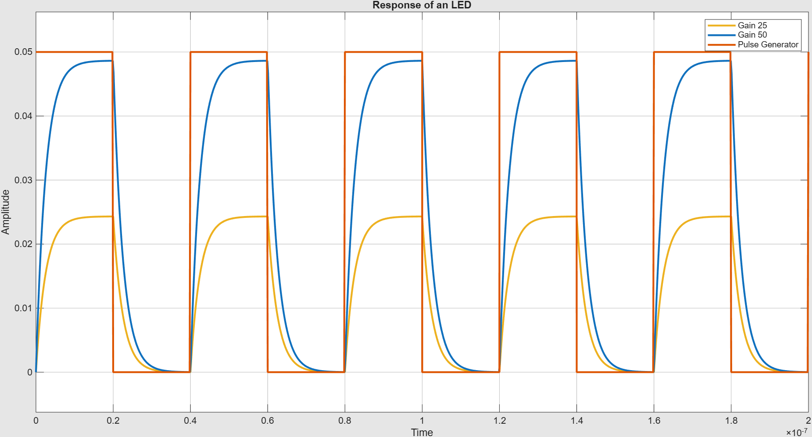

## 1. Theoretical Background and Mathematical Model of Light Emitting Diode (LED)

The behavior of an LED in an optical fiber link can be modeled using a small-signal frequency-domain approach. The output optical power $P_e(f)$ (in Watts) is a function of the injected drive current $I_d(f)$ (in Amperes) and the LED's total transfer function $H_T(f)$:

$$P_e(f) = H_T(f) \cdot I_d(f)$$

The total transfer function is divided into two distinct parts: a static DC gain $H_T(0)$ and a dynamic normalized frequency response $H_T^*(f)$.

### 1.1 DC Transfer Function: $H_T(0)$
The $H_T(0)$ term represents the overall steady-state quantum efficiency of the LED. It determines how many watts of optical power are generated per ampere of injected current.

$$H_T(0) = \left( \frac{hc}{\lambda q} \right) \eta_{int} \eta_{inj} \eta_{ext}$$

Where the efficiencies are defined as:
* **Internal Quantum Efficiency ($\eta_{int}$):**
  $$\eta_{int} = \frac{\tau_{nr}}{\tau_{nr} + \tau_r}$$
* **External Quantum Efficiency ($\eta_{ext}$):**
  $$\eta_{ext} = \left[ 1 - \left(\frac{n_s - n_a}{n_s + n_a}\right)^2 \right] \left[ 1 - \cos\left(\frac{n_a}{n_s}\right) \right]$$

### 1.2 Dynamic Transfer Function: $H_T^*(s)$
The dynamic part, $H_T^*(f)$, models the transient response (the exponential rise and fall) of the LED due to the carrier recombination lifetime. The paper provides the frequency domain equation:
$$H_T^*(f) = \frac{1}{1 + j f/f_c} \quad \text{where} \quad f_c = \frac{1}{2\pi\tau_r}$$

Substituting $s = j2\pi f$, this translates perfectly into a continuous-time 1st-order low-pass filter in the Laplace ($s$) domain:
$$H_T^*(s) = \frac{1}{\tau_r s + 1}$$

### 1.3 Physical Parameters
### 1.3 Physical Parameters
| Parameter | Symbol | Description | Unit | Value |
| :--- | :--- | :--- | :--- | :--- |
| **Emission wavelength** | $\lambda$ | Operating wavelength of the LED | m | $850 \times 10^{-9}$ |
| **Radiative lifetime** | $\tau_r$ | Radiative carrier lifetime | s | $5.0 \times 10^{-9}$ |
| **Non-radiative lifetime** | $\tau_{nr}$ | Non-radiative carrier lifetime | s | $50.0 \times 10^{-9}$ |
| **Injection efficiency** | $\eta_{inj}$ | Current-injection efficiency | - | $0.90$ |
| **Semiconductor index** | $n_s$ | Refractive index of semiconductor | - | $3.60$ |
| **Media index** | $n_a$ | Refractive index of surrounding media | - | $1.00$ |

---

## 2. Creation of the LED Subsystem

To keep the Simulink canvas clean and improve computational efficiency, the static efficiency calculations are offloaded to a Mask Initialization script.

### 2.1 Mask and Dialog Box
The subsystem is masked, prompting the user for the physical parameters. Because the inputs for the LED (wavelength, lifetimes) are requested directly in standard SI units (meters, seconds), no unit conversion is necessary in the background script.

### 2.2 Initialization Code (MATLAB Script)
This script retrieves the mask parameters, evaluates the complex fractional and trigonometric expressions for efficiency, and defines the `HT_0` variable for the block diagram.

```matlab
classdef led_mask_init
    methods(Static)
        function MaskInitialization(maskInitContext)
            % Access the mask workspace object
            ws = maskInitContext.MaskWorkspace;
            
            % 1. Retrieve parameters from the dialog box
            lambda  = ws.get('lambda');
            tau_r   = ws.get('tau_r');
            tau_nr  = ws.get('tau_nr');
            eta_inj = ws.get('eta_inj');
            n_s     = ws.get('n_s');
            n_a     = ws.get('n_a');
            
            % Universal Constants
            h = 6.62e-34;
            c = 2.9979e8;
            q = 1.602e-19;
            
            % 2. Calculate Efficiencies
            eta_int = tau_nr / (tau_nr + tau_r);
            eta_ext = (1 - ((n_s - n_a)/(n_s + n_a))^2) * (1 - cos(n_a/n_s));
            
            % 3. Calculate HT_0 (The DC Transfer Function)
            HT_0 = ((h * c) / (lambda * q)) * eta_int * eta_inj * eta_ext;
            
            % 4. Push the calculated variables back to the mask workspace
            ws.set('HT_0', HT_0);
            ws.set('tau_r', tau_r); 
        end
    end
end
```

---

## 3. Subsystem Block Architecture

With the math handled by the initialization script, the LED subsystem consists of just three functional blocks in series:

1. **Inport (`I_d`):** Receives the drive current (Amperes) from the main model.
2. **Gain Block (`HT_0`):** Multiplies the input current by the static steady-state quantum efficiency ($H_T(0)$) calculated by the initialization script. It outputs baseline optical power in Watts.
3. **Transfer Fcn Block:** Implements the $s$-domain equation $H_T^*(s)$ to model the LED's transient response limit.
   * **Numerator coefficients:** `[1]`
   * **Denominator coefficients:** `[tau_r 1]`
4. **Outport (`P_f`):** Outputs the fully modeled optical power transient.

### 3.1 Model Snapshots

| Top-Level Model | Subsystem Internals |
|:---:|:---:|
|  |  |

**Top-level model:** The canvas shows a unipolar Pulse Generator (0–50 mA, 25 MHz) driving the masked LED subsystem directly. The output optical power (in Watts) is scaled by a ×1000 Gain block to display in milliwatts on the Scope.

**Subsystem internals:** Inside the mask, the signal flows through just two signal-processing blocks — the `HT_0` static gain and the 1st-order `Transfer Fcn`. The entire LED physics is encapsulated in this deceptively simple two-block chain.

---

## 4. Main Model Configuration

To test the LED and replicate the results from the literature (Figure 9), the external environment requires a specific unipolar pulse and fine-tuned solver settings.

### 4.1 Drive Current and Routing
Physical LEDs act as diodes and require a unipolar forward current, unlike standard symmetric signal generators.
* **Pulse Generator:** Configured to output a 25 MHz square wave that swings from 0 mA to 50 mA.
  * Amplitude: `0.05` (50 mA)
  * Period: `40e-9` (40 ns)
  * Pulse Width: `50%`
* **Output Gain:** The LED subsystem natively outputs optical power in Watts. A Gain block of `1000` is placed immediately after the LED to convert the output to milliwatts (mW) for easier viewing on the Scope.

### 4.2 Solver Details
Because the unipolar pulse acts as a sudden step input and the LED's response time is governed by $\tau_r$ (in the nanosecond range), Simulink's variable-step solver can take overly large steps, resulting in a jagged, fragmented plot.
* **Smoothing the Trace:** The solver's **Max step size** is strictly constrained to `1e-10` (0.1 ns) in the Model Settings. This forces Simulink to calculate enough data points to perfectly render the smooth exponential rise and decay curves of the LED's optical power.

---

## 5. Simulation Results



### Reading the Scope — What the Physics Tells Us

**Exponential rise on the leading edge.** When the drive current steps from 0 mA to 50 mA, the optical power $P_f(t)$ does not jump instantaneously. It rises as $P_f(t) \propto 1 - e^{-t/\tau_r}$, governed entirely by the radiative carrier lifetime $\tau_r$. This is the direct signature of the 1st-order low-pass pole at $f_c = 1/(2\pi\tau_r)$: higher-frequency Fourier components in the square-wave drive are progressively attenuated, rounding the sharp current edges into smooth optical curves.

**Exponential decay on the trailing edge.** When the current returns to zero, carriers recombine and the optical field decays as $P_f(t) \propto e^{-t/\tau_r}$. The time constant is symmetric with the rise — the same $\tau_r$ governs both edges because the transfer function is linear.

**Bandwidth ceiling.** The 3 dB modulation bandwidth of this LED is $f_{3dB} = 1/(2\pi\tau_r)$. For nanosecond-scale $\tau_r$ values, this limits the LED to tens or hundreds of MHz — which is why LEDs are reserved for short-reach, moderate-bandwidth links (e.g., local-area fiber networks), while LASER diodes are used for high-speed long-haul communications.


